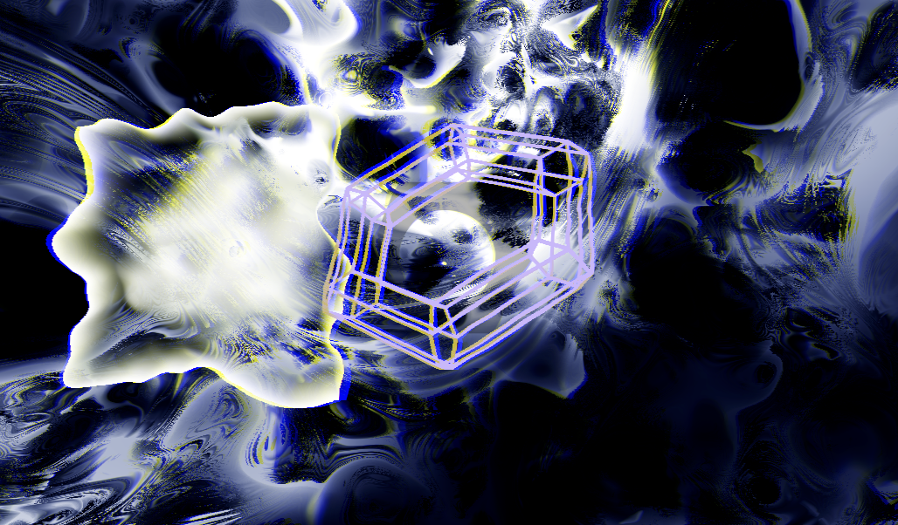

# GSeq

[](https://crates.io/crates/gseq)

GSeq is a realtime visual performance program written in [Rust](https://www.rust-lang.org/) based on [wgpu](https://wgpu.rs/). GSeq reacts to the audio input to animate the visuals.

## Installation

### Cargo

If you already have a Rust environment set up, you can use the `cargo install` command:

```bash
cargo install gseq
```

## Usage

You can select the visual show with the `-s` option. For example to run the `marius-julien` show:

```bash
gseq -s marius-julien 
```

Available visual shows:
| Visual Show |
|-|
|`marius-julien`|
|`lua`|

## Screenshot

[]
